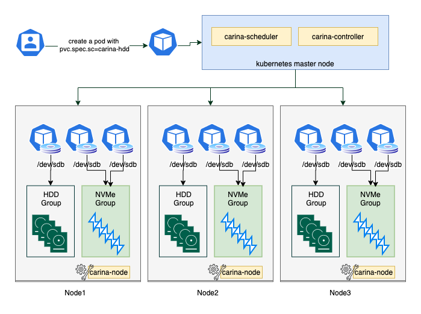

#### Carina
[](https://github.com/BoCloud/carina/blob/master/LICENSE)

Carina是一款基于Kubernetes CSI标准实现的存储插件，用户可以使用标准的storageClass/PVC/PV原语申请carina提供的存储介质；carina包含三个主要组件：carina-scheduler、carin-controller以及carina-node，全部以容器化形式运行在Kubernetes中，并且占用极少的资源。
Carina是为数据库而生的本地存储方案，编排管理本地磁盘并根据磁盘类型构建多种资源池，为数据库等应用提供极致性能的本地存储

#### 支持环境

- Kubernetes：1.20 1.19 1.18
- Node OS：Linux
- Filesystems：ext4，xfs

#### 总体架构



#### 组件介绍

​    如上图架构所示，carina能够自动发现本地裸盘，并根据其磁盘特性划分为hdd磁盘卷组及ssd磁盘卷组等，针对于本地数据高可用，carina推出了基于bcache的磁盘缓存功能以及自动组建RAID功能

- carina-node是运行在每个节点上的agent服务，利用lvm技术管理本地磁盘，按照类别将本地磁盘划分到不同的VG中，并从中划分LV提供给Pod使用。
- carina-scheduler是Kubernetes的调度插件，负责基于申请的PV大小、节点剩余磁盘空间大小，节点负载使用情况进行合理的调度。默认提供了spreadout及binpack两种调度策略
- carina-controller是carina的控制平面，监听PVC等资源，维护PVC、LV之间的关系

#### 功能列表

- [安装](docs/manual/install.md)
- [磁盘管理](docs/manual/disk-manager.md)
- [设备注册](docs/manual/device-register.md)
- [基于文件系统使用](docs/manual/pvc-xfs.md)
- [基于块设备使用](docs/manual/pvc-device.md)
- [pvc扩容](docs/manual/pvc-expand.md)
- [基于容量的调度](docs/manual/capacity-scheduler.md)
- [卷拓扑](docs/manual/topology.md)
- [磁盘缓存使用](docs/manual/pvc-bcache.md)
- [raid管理](docs/manual/raid-manager.md)
- [容灾转移](docs/manual/failover.md)
- [磁盘限速](docs/manual/disk-speed-limit.md)
- [指标监控](docs/manual/metrics.md)
- [API](docs/manual/api.md)
- [FAQ](docs/manual/FAQ.md)

#### 快速开始

- 部署步骤
```shell
$ cd deploy/kubernetes
# 安装
$ ./deploy.sh
# 卸载
$ ./deploy.sh uninstall
```
- 详细部署及使用参考[使用手册](docs/user-guide.md)

#### 贡献项目

- [开发文档](docs/manual/development.md)
- [构建运行时容器](docs/manual/runtime-container.md)

#### 常见存储方案对比

|            | NFS/NAS                    | SAN                                         | Ceph                                       | Carina                                                       |
| ---------- | -------------------------- | ------------------------------------------- | ------------------------------------------ | ------------------------------------------------------------ |
| 设计场景   | 通用存储场景               | 高性能块设备                                | 追求扩展性的通用存储场景                   | 为云数据库而生的高性能块存储                                 |
| 文件存储   | 支持                       | 支持                                        | 支持                                       | 支持                                                         |
| 块存储     | 不支持                     | 视驱动程序而定                              | 支持                                       | 支持                                                         |
| 文件系统   | 不支持格式化               | 视驱动程序而定                              | 支持ext4/xfs等                             | 支持ext4/xfs等                                               |
| 宽带       | 差/中等                    | 中等                                        | 高                                         | 高                                                           |
| IOPS       | 差/中等                    | 高                                          | 中等                                       | 低                                                           |
| 延迟       | 差/中等                    | 低                                          | 差                                         | 支持                                                         |
| CSI支持    | 支持                       | 支持                                        | 支持                                       | 支持                                                         |
| 快照       | 不支持                     | 视驱动程序而定                              | 支持                                       | 待支持                                                       |
| 克隆       | 不支持                     | 视驱动程序而定                              | 支持                                       | 待支持                                                       |
| 配额       | 不支持                     | 支持                                        | 支持                                       | 支持                                                         |
| 扩容       | 支持                       | 支持                                        | 支持                                       | 支持                                                         |
| 数据高可用 | 依赖RAID或NAS设备          | 支持                                        | 支持                                       | 依赖RAID                                                     |
| 可维护性   |                            | 不同的SAN设备需要不同的驱动程序，管理成本高 | 架构复杂，需要专人维护                     | 高                                                           |
| 成本       | NFS服务器或NAS设备，成本高 | SAN设备，客户端配置HBA卡，成本高            | 专用存储集群，客户端需配置存储网卡，成本高 | K8s集群中剩余的本地磁盘，成本低                              |
| 其他特性   | 容器迁移后数据跟随         | 容器迁移后数据跟随                          | 支持对象存储，容器迁移后数据跟随           | 支持binpack/spreadout等调度策略<br>针对有状态容器，支持原地重启、重建<br>容器迁移后，数据不能跟随，需要应用层面实现数据恢复 |

