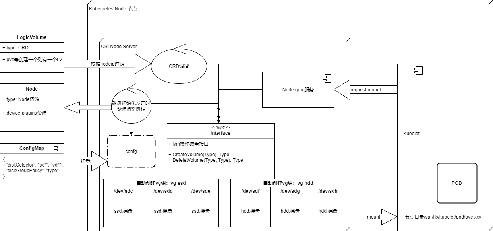

#### CSI 驱动设计

#### 前言

- CSI定义了存储驱动服务实现的接口，对于此我们没有发挥的空间，按照CSI要求按部就班的实现就好

#### 功能设计

- pvc创建后会调用驱动`CreateVolume`方法，此时控制服务根据pv调度进行下一步操作
- 控制节点创建CRD资源，节点服务监听CRD资源创建，收到创建事件后在本地磁盘创建volume卷
- 创建volume卷成功后更新节点设备容量，并通过configmap暴露各节点磁盘容量信息

#### 具体细节

- 创建pvc后，控制服务接收创建volume请求，并创建CRD

  ```
  +------------+         +--------------------+         +---------------------+
  | PVC Create |-------->|  Controller Server |-------->| Create CRD Resource |
  +------------+         +--------------------+         +---------------------+  
  ```

- 节点服务运行架构图

  - 磁盘管理模块提供操作磁盘的接口

  - 定时协程，定时扫描本次磁盘与配置对比，完成磁盘初始化以及与device-plugins配额校准

  - CRD调谐程序负责根据创建LogicVolume事件，操作lvm接口完成真实volume操作

  - Kubelet调用Node grpc服务，完成volume卷操作

  


