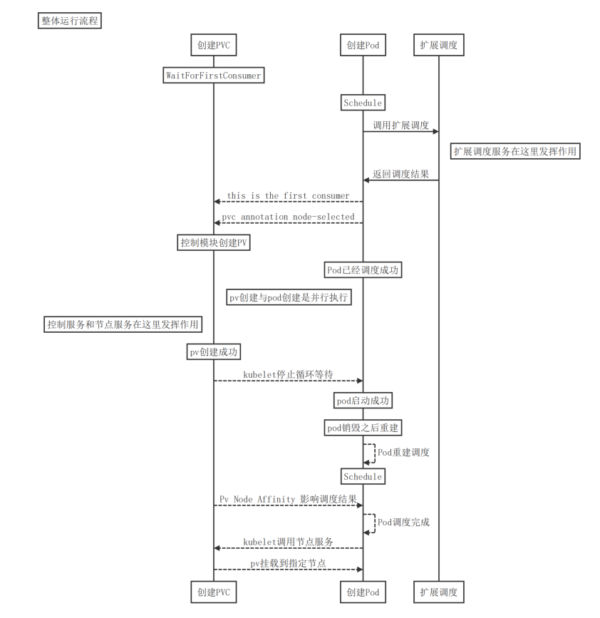
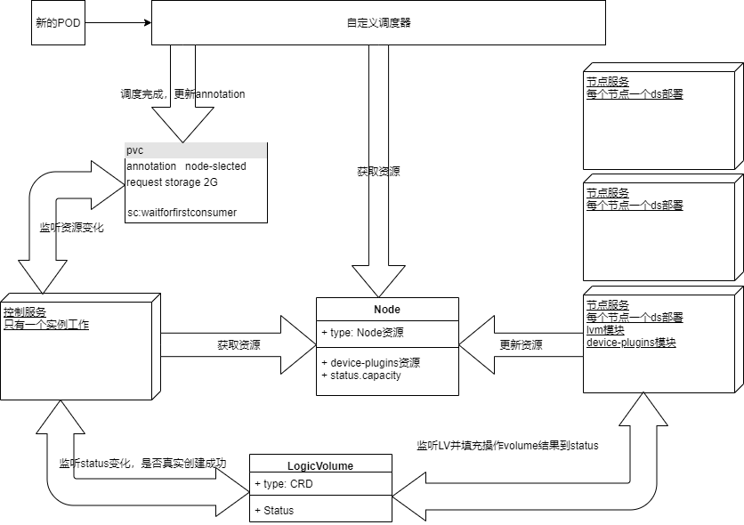

#### 基于本地存储的总体设计方案

#### 介绍

- 在业务实际应用场景中，总是有服务需要更高的磁盘性能，基于此本地存储项目应运而生，用于解决在特定场景下高性能的使用本地存储
- 该项目基于CSI设计，辅之本地磁盘管理功能、基于本地存储的调度器机制、本地设备注册，来共同满足业务容器高性能使用本地磁盘的场景

#### 功能设计

- 本次存储功能支持概览


| Carina功能 | 是否支持 |
| ---------- | -------- |
| 动态pv     | 支持     |
| 文件存储   | 支持     |
| 块存储     | 支持     |
| 容量限制   | 支持     |
| 自动扩容   | 支持     |
| 快照       | 暂不支持 |
| 拓扑       | 支持     |


- 根据CSI设计，控制服务与节点服务是必须有的，我们增加了扩展调度组件
- 其整体运行流程如下所示：

  ```sequence
  title: 整体运行流程
  participant 创建PVC as pvc
  participant 创建Pod as pod
  participant 扩展调度 as scheduler
  Note over pvc: WaitForFirstConsumer
  Note over pod: Schedule
  pod->scheduler: 调用扩展调度
  Note right of scheduler: 扩展调度服务在这里发挥作用
  scheduler->pod: 返回调度结果
  pod-->pvc: this is the first consumer
  pod-->pvc: pvc annotation node-selected
  Note over pvc: 控制模块创建PV
  Note over pod: Pod已经调度成功
  Note left of pod: pv创建与pod创建是并行执行
  Note left of pvc: 控制服务和节点服务在这里发挥作用
  Note over pvc: pv创建成功
  pvc-->pod: kubelet停止循环等待
  Note over pod: pod启动成功
  Note over pod: pod销毁之后重建
  pod-->pod: Pod重建调度
  Note over pod: Schedule
  pvc-->pod: Pv Node Affinity 影响调度结果
  pod-->pod: Pod调度完成
  pod-->pvc: kubelet调用节点服务
  pvc-->pod: pv挂载到指定节点
  ```
  
  
- 整体运行架构
  - 控制服务和扩展调度服务只有一个实例提供服务，节点服务以DS部署在每个节点均提供服务
  - 控制服务和节点服务通过一个CRD进行数据交换
  - 节点服务更新node.status.capacity配额资源，调度服务与控制服务获取扩展资源进行pv调度
  - Schedule进行节点评分与选择，调度完成更新pvc annotation表示该pvc有消费者了

  

  

