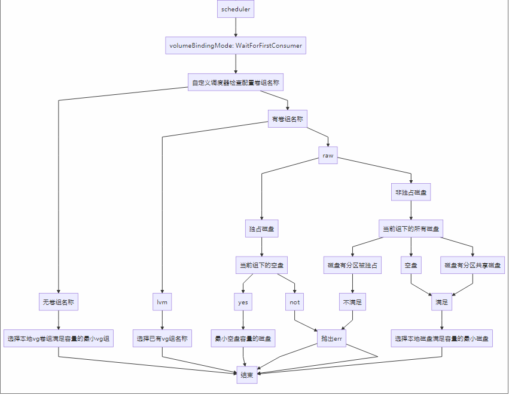
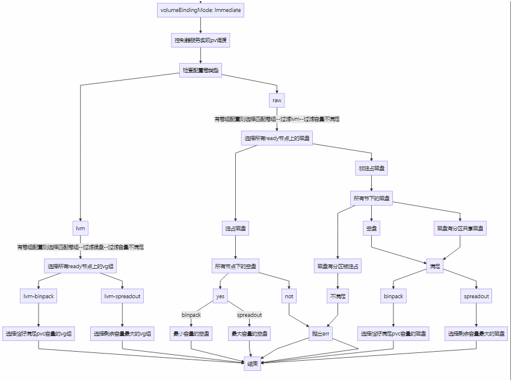
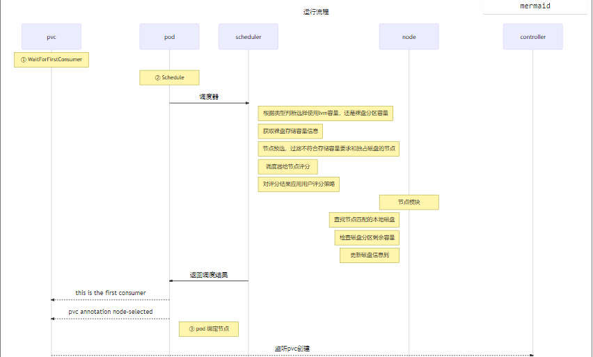
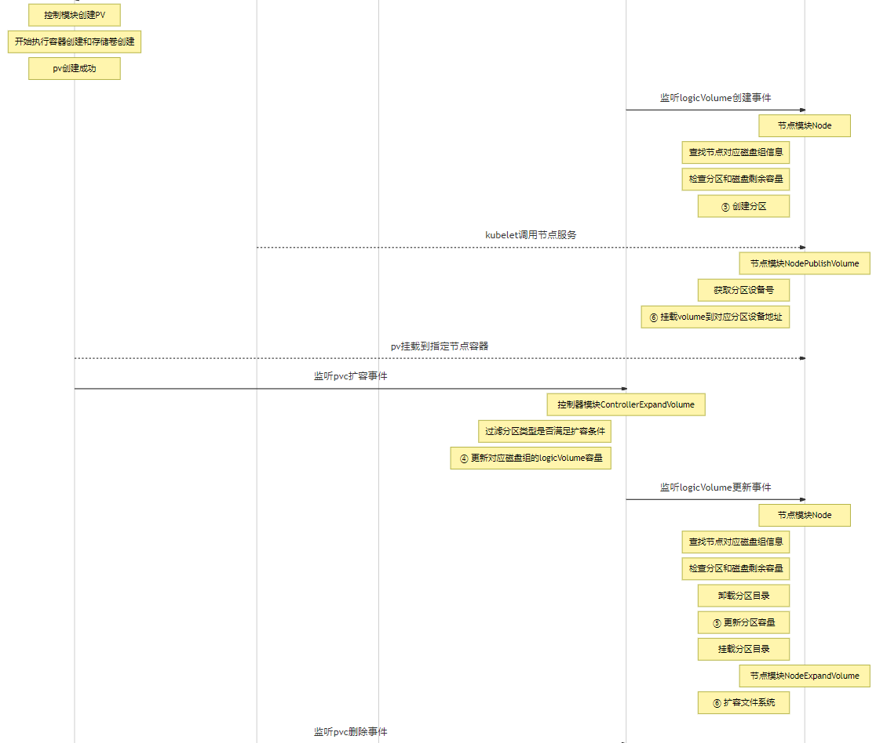
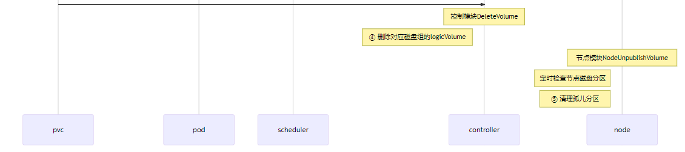

## 基于本地存储使用裸盘设计方案

### 介绍

- 在业务实际应用场景中，基于提高性能的考虑，磁盘管理不使用lvm,而是直接使用裸盘。

### 功能设计

- 控制节点创建CRD资源和负责维护crd节点状态，节点服务监听CRD资源创建，收到创建事件后维护本地磁盘状态
- 通过配置文件获取扫描时间间隔和磁盘的匹配条件,检查磁盘是否匹配正则条件，符合条件的磁盘会被节点crd对象nodestorageresource接管。
- 裸盘按storageclass 参数配置 `carina.storage.io/exclusively-raw-disk`可以分为独占式和共享式。独占式支持扩容，共享式不支持扩容。

### 实现细节
- 控制器周期获取节点状态，来维护NodeDeive的状态
- 裸盘磁盘匹配规则
```
config.json: |-
    {
      "diskSelector": [
        {
          "name": "carina-raw-ssd" ,
          "re": ["loop3"], 
          "policy": "RAW",
          "nodeLabel": "kubernetes.io/hostname"
        },
        {
          "name": "carina-raw-hdd",
          "re": ["loop*+"],#可以匹配多块磁盘
          "policy": "RAW",
          "nodeLabel": "kubernetes.io/hostname"
        }
      ],
      "diskScanInterval": "300",
      "schedulerStrategy": "spreadout"
    }
```
- storageClass新增加参数配置"carina.storage.io/exclusively-raw-disk",true是指pod独占磁盘,false是多个pod共享磁盘；
```yaml
  apiVersion: storage.k8s.io/v1
  kind: StorageClass
  metadata:
    name: csi-carina-sc
  provisioner: carina.storage.io # 这是该CSI驱动的名称，不允许更改
  parameters:
    # 这是kubernetes内置参数，我们支持xfs,ext4两种文件格式，如果不填则默认ext4
    csi.storage.k8s.io/fstype: xfs
    carina.storage.io/disk-group-name: carina-raw-ssd 
    carina.storage.io/exclusively-raw-disk: false  # 新增加参数是否是独占式，默认fasle
  reclaimPolicy: Delete
  allowVolumeExpansion: true # 支持扩容，定为true便可
  # WaitForFirstConsumer表示被容器绑定调度后再创建pv
  volumeBindingMode: WaitForFirstConsumer
  # 支持挂载参数设置，默认为空
  # 如果没有特殊的需求，为空便可满足大部分要求
  mountOptions:
    - rw
  ```

- 调度策略不变。binpack：选择恰好满足pvc容量的节点；spreadout：选择剩余容量最大的节点，这个是默认调度策略

```
   config.json: |-
      {
        "schedulerStrategy": "spreadout" # binpack，spreadout支持这两个参数
      }
```
- 磁盘模型划分如下

  ```
  独占式磁盘
  +-------------------------+                
  | 主分区 ( pvc分区容量)        |
  | 主分区 (磁盘剩余分区容量)    |
  +-------------------------+  
  
  共享式磁盘
  +-------------------------+                
  |主分区 (pvc1分区容量)          |
  |主分区 (磁盘剩余分区容量)       |
  |主分区 (pvc2分区容量)          |
  |主分区 (pvc...分区容量)          |
  |主分区 (磁盘剩余分区容量)       |
  +-------------------------+     

  ```


### 实现逻辑
#### 1. 管理分区容量
每个节点控制器会检查当前本地节点磁盘，匹配配置文件正则条件，符合条件的记录信息到nodestorageresource里
节点定时10分钟检查没有分区是否有pvc使用，没有使用的分区的会释放掉。

#### 2. 裸盘调度策略
  - 调度器选择裸盘逻辑是筛选nodestorageresource的allocatable可用资源是否满足资源申请
  - 控制器选择逻辑是：
     ①如果是独占磁盘类型的资源申请，调度策略是选择storageclass 配置的磁盘组名称下匹配的磁盘，选择一个空盘创建；
     ②如果不是独占磁盘类型的资源申请，控制器调度策略是匹配选择storageclass 配置的磁盘组名称下匹配的磁盘上剩余分区容量最小的磁盘调度；
     ③独占磁盘类型的资源申请支持扩容
     ④不是独占磁盘类型的资源申请，不支持扩容
     ⑤默认不填写是否申请使用独占磁盘，则表示使用共享磁盘；
     ⑥默认不填写磁盘组名称；则表示使用lvm卷模式
  - 如果StorageClass参数volumeBindingMode=Immediate；则表示由控制器选择节点和磁盘组
    ①控制器会选择所有节点上裸盘剩余磁盘可用分区;
    ②如果是独占磁盘，筛选所有节点没有分区的磁盘；满足不同的调度策略（binpack，spreadout）；
    ③如果不是独占磁盘，优先筛选所有节点有分区的磁盘去满足调度策略，如果没有匹配则筛选空白磁盘满足调度策略（binpack，spreadout）
  - binpack：选择恰好满足pvc容量的节点，和 选择剩余容量恰好满足的分区
  - spreadout：选择剩余容量最大的节点和选择剩余容量最大节点的分区，这个是默认调度策略




#### 3. 创建分区
 >默认创建GPT分区 ，检测裸盘已有分区。查看可分配空间节点位置，采用最佳适应算法（Best Fit），分区删除和增加必然造成很多不连续的空余空间。这就要求将所有的空闲区按容量递增顺序排成一个空白链。这样每次找到的第一个满足要求的空闲区，必然是最优的

使用分区命令创建如下：
```
# parted /dev/loop2 mklabel gpt #设置分区格式
# parted /dev/loop2 mkpart myloop1 0 10G
# parted /dev/loop2 mkpart myloop2 10G 20G 
# parted /dev/loop2 mkpart myloop3 20G -0G
# parted /dev/loop2 p
parted /dev/loop2 p free
# blkid |grep myloop3  # 查看分区num,label uuid 

partprobe    #同步磁盘分区表                
fdisk -lu /dev/loop2
```
#### 4. 扩容分区
- ① storage配置参数注解pod独占整块磁盘可以扩容
- ② 多个pods共享磁盘不支持扩容
- ③ 扩展已有GPT分区
```

dump -0uj -f /tmp/loop2p1bak.bz2 /dev/loop2p1
restore -r -f /tmp/loop2p1bak.bz2
export path=$(findmnt -S /dev/loop2p1 --output=target --noheading)
umount path
parted /dev/loop2 resizepart 1（分区号）  600（end位置）
parted /dev/loop2 p
mount  /dev/loop2p1  path
```

#### 删除分区
```
lv 和裸盘分区绑定，删除lv 就删除裸盘pod占用的分区
parted /dev/loop2 rm 
parted /dev/loop2 p1
```
### 整体流程图






