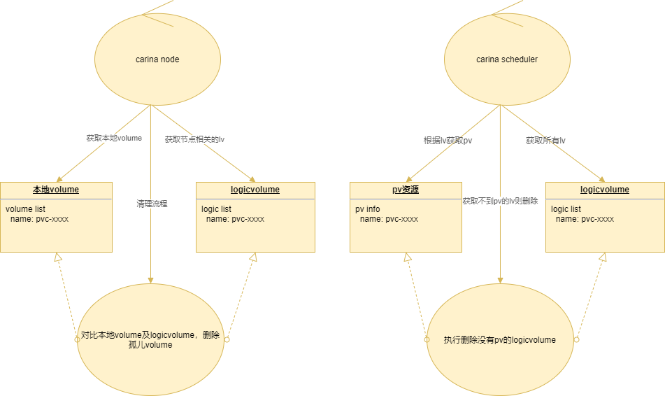

#### 定时清理孤儿卷

#### 问题背景

- 在对carina测试阶段，有时会出现如下几种现象
  - Kubernetes中logicvolume资源存在，但是对应节点并没有真实的volume卷
  - 节点拥有真实volume卷，但是相应的Kubernetes中logicvolume并不存在

#### 问题分析

- 出现如上几种情况的原因如下：
  - 多次安装卸载carina，logicvolume被强制删除，而节点volume由于pod已下线无法删除
  - 特定情况下节点volume删除失败，但是logicvolume删除成功
  - 未知问题导致logicvolume创建多个
  - 在删除过程中容器重启，导致正在运行中逻辑终止

#### 设计原则

- 节点volume必须有对应的logicvolume，任何节点多余的volume称为孤儿volume，需要清理
- logicvolume必须有对应的pv，任何多余的logicvolume需要被清理
- 当节点被删除时，在这个节点的上的所有volume将在其他节点重建

#### 功能实现

- carina-node启动定时任务，获取集群所有指向本节点的logicvolume，然后与本地volume进行对比，将本地孤儿volume进行清理
- carina-controller启动定时任务，获取logicvolume，然后获取对应的pv，对于没有pv的logicvolume则删除

  
